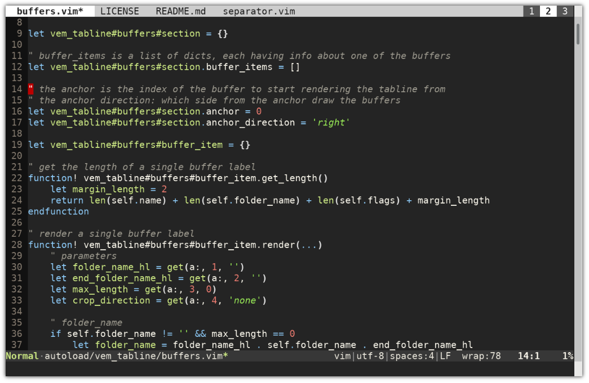

Vem Tabline
===========

Vem Tabline is a lightweight Vim plugin to display your tabs and buffers at the
top of your screen using Vim's tabline.



In Vim:

    * Buffers are your documents/files.

    * Tabs are workspaces that you can use to arrange your windows in different
      layouts.

With Vem Tabline you can see both, your open files and your different
workspaces, and which ones are currently selected.

In Vim you can't confine buffers to certain tabs. All tabs can access all
buffers at all times. You only use tabs to define window arrangements over
those buffers. Vem Tabline shows buffers according to that idea. When you have
a single window open in a tab, you see all the open buffers. However, when you
have multiple windows open in a tab you only see the names of the buffers
displayed in those windows. This way you can see the relevant buffers when you
have complex layouts.

You can use Vem Tabline right away without aditional configuration. Just
install the plugin and start using it. You only need to configure it if you
want to manually order the buffers in the tabline (explained below).

Features
--------

There are many Vim plugins to display the list of buffers. I created Vem
Tabline because none of them had the features I needed:

    * Use of Vim's native tabline (no horizontal splits).

    * Support for displaying both buffers and tabs simultaneously.

    * Support for Vim's native commands (no re-mappings necessary -there are
      available key mappings but they are optional).

    * Possibility to reorder the buffers in the tabline.

    * No fighting against Vim's native concepts (in particular no
      scoping buffers to certain tabs).

    * Lightweight, performant and just focused on providing the tabline
      functionality.

The design of Vem Tabline is based on two very cool ones:
[vim-buftabline](https://github.com/ap/vim-buftabline) and
[WinTabs](https://github.com/zefei/vim-wintabs). It doesn't share code with
them but most ideas come from their original authors.

Moving Buffers in Tabline
-------------------------

Vem Tabline allows you to change the order in which buffers are shown in each
tab. To do so, use the following `<Plug>` mappings:

    Move selected buffer to the left:  `<Plug>vem_tabline_move_buffer_left-`
    Move selected buffer to the right: `<Plug>vem_tabline_move_buffer_right-`

Vim doesn't support ordering buffers natively so if you use `:bnext` and
`:bprev`, they will not follow the order of buffers in the tabline if you have
modified it. To avoid this problem you can use the following mappings:

    Select previous buffer in tabline: `<Plug>vem_tabline_prev_buffer-`
    Select next buffer in tabline:     `<Plug>vem_tabline_next_buffer-`

For example you could set your mappings like:
```
    nmap <leader>h <Plug>vem_tabline_move_buffer_left-
    nmap <leader>l <Plug>vem_tabline_move_buffer_right-
    nmap <leader>p <Plug>vem_tabline_prev_buffer-
    nmap <leader>n <Plug>vem_tabline_next_buffer-
```

Color Scheme
------------

Vem Tabline uses the default colors of your color scheme for rendering the
tabline. However you may change them using the following highlighting groups:

Highlighting Group    | Default     | Meaning
----------------------|-------------|------------------------------
VemTablineSelected    | TabLineSel  | Selected buffer
VemTablineNormal      | TabLine     | Non selected buffer
VemTablineLocation    | TabLine     | Directory name (when present)
VemTablineSeparator   | TabLineFill | +X more text
VemTablineTabSelected | TabLineSel  | Selected tab
VemTablineTabNormal   | TabLineFill | Non selected tab

